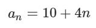

# Exercise No. 14

The arithmetic sequence is given with the following formula:

Calculate the sum of the first ten elements of this sequence. Print the result to the console as shown below.

**Expected result:**

    The sum of the first 10 elements in a sequence: 320.0