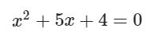

# Exercise No. 16

The quadratic equation is given with the following formula:

Using Vieta's formulas calculate the sum and product of the roots of this quadratic equation. Print the result to the console as shown below.

**Expected result:**

    x1 + x2 = -5.0
    x1x2 = 4.0