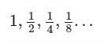

# Exercise No. 21

An infinite geometric sequence is given with the following formula:

Calculate the sum of this sequence. Print the result to the console as shown below.

**Expected result:**

    The sum of the sequence: 2.0