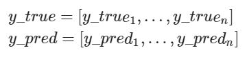
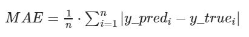

# Exercise No. 185

MAE - Mean Absolute Error is a function that allows you to check the accuracy of the machine learning model. MAE is popular in regression models.

For any:

MAE can be calculated by the following formula:

**Example:**

    [IN]: y_true = [10, 10.5, 11.2, 10.4]
    [IN]: y_pred = [10.2, 10.4, 10.8, 11.0]
    [IN]: mae(y_true, y_pred)
    [OUT]: 0.325

Implement a function called mae(). Round the result to three decimal places.

**Note:** You only need to implement this function.