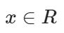
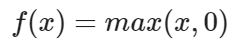

# Exercise No. 187

Implement a function called relu() (ReLU - Rectified Linear Unit). This function is used in neural networks and is given by the following formula:

**Note:** You only need to implement this function.