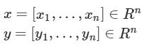
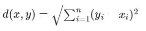

# Exercise No. 190

For any:

we define the Euclidean distance by the formula:

Implement a function called euclidean_distance() that computes the distance between two points.

**Example:**

    [IN]: euclidean_distance([0, 3], [4, 0])
    [OUT]: 5.0

**Note:** You only need to implement this function.