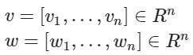
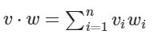

# Exercise No. 199

Dot product of vectors v, w:

we define as:

Implement a function called dot_product() that takes two lists of the same length (vectors) and calculate the dot product. We assume that user gives a correctly defined vector.

**Example:**

    [IN]: dot_product([1, 2], [5, 2])
    [OUT]: 9

**Note:** You only need to implement this function.

